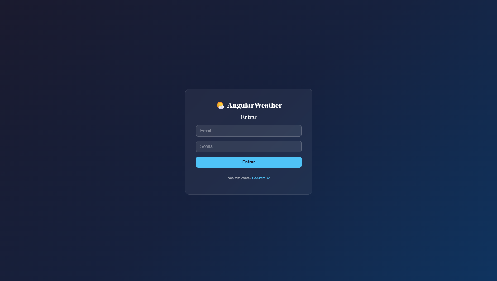
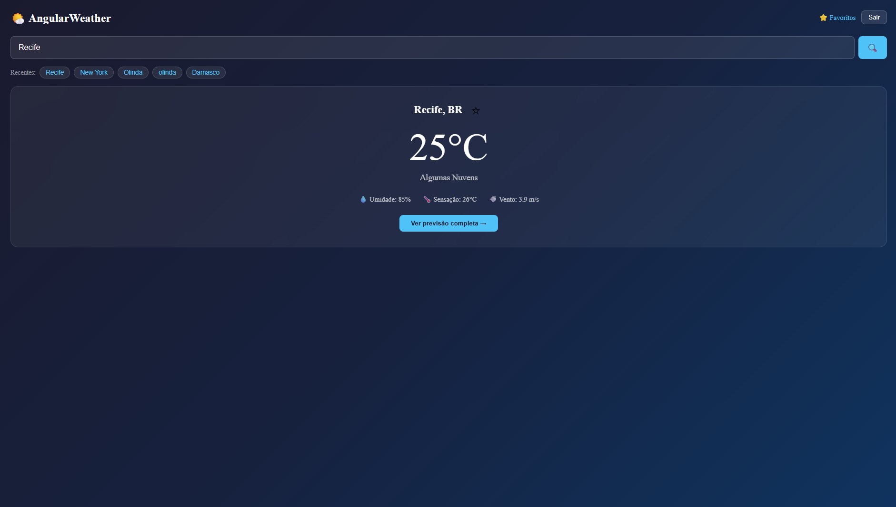

# 🌤️ AngularWeather

Aplicativo web de monitoramento climático desenvolvido com Angular, consumindo a API REST da OpenWeatherMap.

## 📋 Sobre o Projeto

O AngularWeather permite que usuários visualizem as condições climáticas atuais e previsões de diferentes cidades do mundo. O sistema conta com autenticação via JWT, busca de cidades, favoritos e previsão por hora e por dia.

## 🚀 Funcionalidades

- ✅ Autenticação de usuário (cadastro e login com JWT)
- ✅ Busca de cidades com histórico de pesquisas recentes
- ✅ Exibição do clima atual (temperatura, umidade, vento, sensação térmica)
- ✅ Previsão das próximas 24 horas
- ✅ Previsão dos próximos 6 dias
- ✅ Sistema de cidades favoritas
- ✅ Localização automática via GPS
- ✅ Interface responsiva e moderna
- ✅ Cache local com LocalStorage

## 🛠️ Tecnologias

**Frontend**
- Angular 19
- TypeScript
- SCSS
- HttpClient + Interceptors
- LocalStorage

**Backend**
- Node.js
- Express
- JSON Web Token (JWT)
- Bcrypt

**API**
- OpenWeatherMap API

## 📸 Telas

### Login


### Home


### Previsão Completa


## ⚙️ Como Rodar

### Backend
```bash
cd backend
npm install
node src/server.js
```

### Frontend
```bash
cd frontend
npm install
ng serve
```

Acesse: `http://localhost:4200`

## 🔑 Variáveis de Ambiente

Crie um arquivo `.env` dentro de `backend/`:
